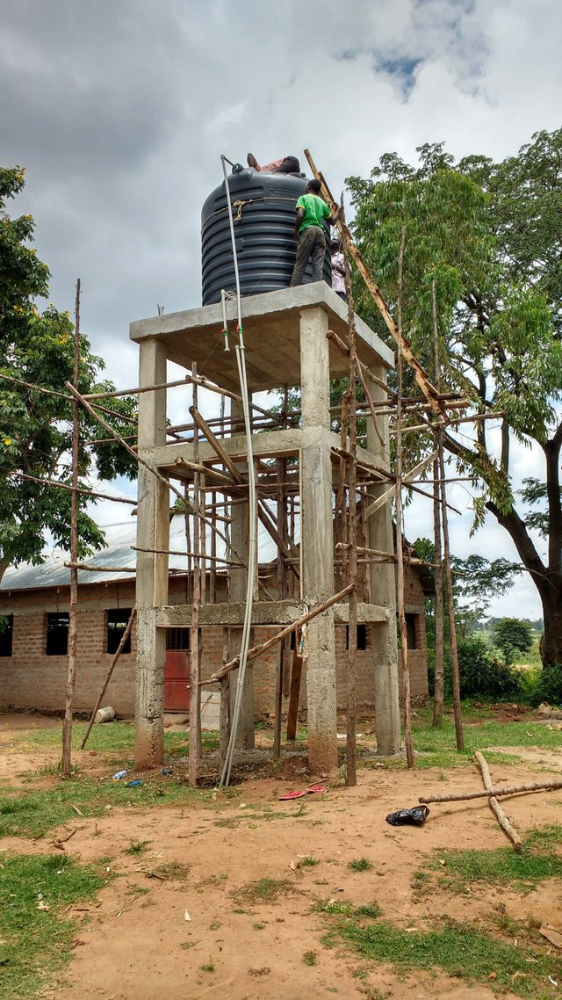

In addition to 5280sprinklers.com, Conrad also operates <a href="https://www.denversprinklerblowout.com">denversprinklerblowout.com</a> during the Fall for sprinkler irrigation winterization.  Focusing on irrigation repairs in Denver, Colorado since 2010, he enjoys working with a select group of clientele who truly understand the value of quality service, communication and punctuality which are all bi-directional in nature.

From time to time, Conrad endeavors to make a small difference while traveling abroad as a photographer.  Humanitarian needs are literally everywhere (yes, here in the good ole USA too).  Visiting Tororo, Uganda in late 2018, he was able to lend a hand with a drinking well that had not yet had a pump installed along with working to solve a plumbing fitting problem high up on a water tower.

Yes, I'm the one responsible for the non-OSHA compliant ladder rigging:

<a href="https://steemit.com/steemit/@timelapse/making-a-difference-for-young-girls-and-women-in-rural-uganda">Supporting Young girls in rural Uganda</a>

More than 10 years have past since doing several relief trips to the landfill (now closed, but still people dig there) in Phnom Penh, Cambodia.  On several occasions he brought supplies like rice, flip-flops, donated ointment from Bangkok, toothpaste and toothbrushes to the women, children and men who live and work in the landfill.

